# Activity Diagrams - Todo List Application

Tài liệu này chứa các Activity Diagrams cho các luồng chức năng chính của ứng dụng Todo List ở mức high level.

## Mục Lục

1. [Authentication](#1-authentication)
2. [Account Settings](#2-account-settings)
3. [Task Management](#3-task-management)
4. [Group Management](#4-group-management)
5. [Admin System](#5-admin-system)
6. [Notifications](#6-notifications)
7. [Communication](#7-communication)

---

## 1. Authentication

---

## 2. Account Settings

---

## 3. Task Management

---

## 4. Group Management

```mermaid
flowchart TD
    subgraph User["👤 USER"]
        A([Start]) --> B{Action?}
        B -->|Create Group| C[Open Create Modal]
        B -->|Invite Members| D[Open Invite Modal]
        B -->|Handle Invitation| E[View notification]
        
        C --> F[Enter name & description]
        F --> G[Select initial members]
        G --> H[Submit group]
        
        D --> I[Search users by email/name]
        I --> J[Select users to invite]
        J --> K[Send invitations]
        
        E --> L{Accept or Decline?}
        L -->|Decline| M[Click Decline]
        L -->|Accept| N[Click Accept]
        
        H --> O{Success?}
        K --> O
        M --> O
        N --> O
        
        O -->|No| P[Show error]
        P --> B
        O -->|Yes| Q[Update group list in UI]
        Q --> R([End])
    end
    
    subgraph System["⚙️ SYSTEM"]
        H --> S[Verify token & permissions]
        S -->|Denied| T[Return 403]
        S -->|Allowed| U{Members within limit?}
        U -->|No| V[Return 400]
        U -->|Yes| W[Create Group in DB]
        W --> X[Add creator as first member]
        X --> Y[Set as user's currentGroup]
        Y --> Z[Emit group:created event]
        Z --> AA[Return group]
        
        K --> AB[Verify invite permission]
        AB -->|Denied| AC[Return 403]
        AB -->|Allowed| AD[Loop through users]
        AD --> AE{Already member?}
        AE -->|Yes| AF[Skip]
        AE -->|No| AG{Pending invite exists?}
        AG -->|Yes| AF
        AG -->|No| AH[Create invitation notification]
        AF --> AI{More users?}
        AH --> AI
        AI -->|Yes| AD
        AI -->|No| AJ[Emit notification:new events]
        AJ --> AK[Return invitation results]
        
        M --> AL[Verify token]
        AL --> AM[Delete notification]
        AM --> AN[Return success]
        
        N --> AO[Verify token]
        AO --> AP{Notification valid?}
        AP -->|Expired| AQ[Return 400]
        AP -->|Valid| AR{Group exists?}
        AR -->|No| AS[Return 404]
        AR -->|Yes| AT[Add user to group.members]
        AT --> AU[Emit group:memberJoined event]
        AU --> AV[Notify other members]
        AV --> AW[Return group]
        
        T --> O
        V --> O
        AA --> O
        AC --> O
        AK --> O
        AN --> O
        AQ --> O
        AS --> O
        AW --> O
    end
```

---

## 5. Admin System

---

## 6. Notifications

---

## 7. Communication

---

## Summary Table

| # | Flow | Description | Key Features |
|---|------|-------------|--------------|
| 1 | Authentication | Login, Register, Logout | JWT tokens, Google OAuth, Personal Workspace |
| 2 | Account Settings | Profile, Theme, Language, Regional, Password | User preferences management |
| 3 | Task Management | CRUD tasks, Assign, Folders | Role-based permissions, Realtime sync |
| 4 | Group Management | Create, Invite, Accept/Decline | Member limits, Invitation notifications |
| 5 | Admin System | User management, Stats, Logs | Super Admin privileges, Action logging |
| 6 | Notifications | Realtime push, History, Mark read | WebSocket events, Multiple notification types |
| 7 | Communication | Group chat, Direct messages | WebSocket rooms, Mentions, Attachments |

---

## Technical Notes

- **Authentication**: JWT with Access Token (short-lived) and Refresh Token (long-lived)
- **Realtime**: Socket.IO for bidirectional communication
- **Permissions**: Account-level roles (groupRole, isLeader) instead of group member roles
- **Storage**: MongoDB for data, Cloudinary for file attachments
- **API Security**: All endpoints require JWT token in Authorization header

---

*Generated from Todo List Application codebase*
