# Biểu đồ Kiến trúc Hệ thống

## 1. Kiến trúc Tổng thể (High-Level Architecture)

## 2. Luồng Request/Response

## 3. Kiến trúc Backend (Layered Architecture)

## 4. Database Schema Relationships

## 5. Real-time Communication Flow

## 6. Authentication & Authorization Flow

```mermaid
graph TD
    A[Client Request] --> B{Has JWT Token?}
    B -->|No| C[Return 401 Unauthorized]
    B -->|Yes| D[Verify Token Signature]
    D -->|Invalid| E[Return 401 Unauthorized]
    D -->|Expired| F[Check Refresh Token]
    F -->|Valid| G[Issue New Access Token]
    F -->|Invalid| C
    D -->|Valid| H{Admin Route?}
    H -->|Yes| I{Is Admin/Super Admin?}
    I -->|No| J[Return 403 Forbidden]
    I -->|Yes| K[Process Request]
    H -->|No| L{Group Route?}
    L -->|Yes| M{Is Group Member?}
    M -->|No| J
    M -->|Yes| N{Has Required Permission?}
    N -->|No| J
    N -->|Yes| K
    L -->|No| K
    G --> K
```

## 7. Frontend Component Architecture

## 8. Mobile App Architecture

## 9. Chatbot Integration Flow

## 10. Notification System Flow

## 11. File Upload Flow

## 12. Group Management Flow

## 13. Task Timer Flow

## 14. Scalability Architecture

---

**Lưu ý**: Các biểu đồ này sử dụng Mermaid syntax và có thể được render trong các công cụ hỗ trợ Mermaid như GitHub, GitLab, hoặc các Markdown viewers.

