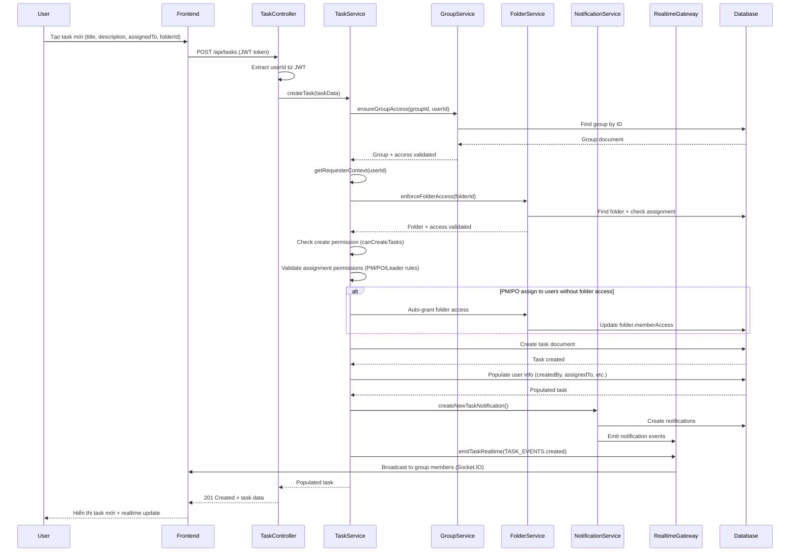
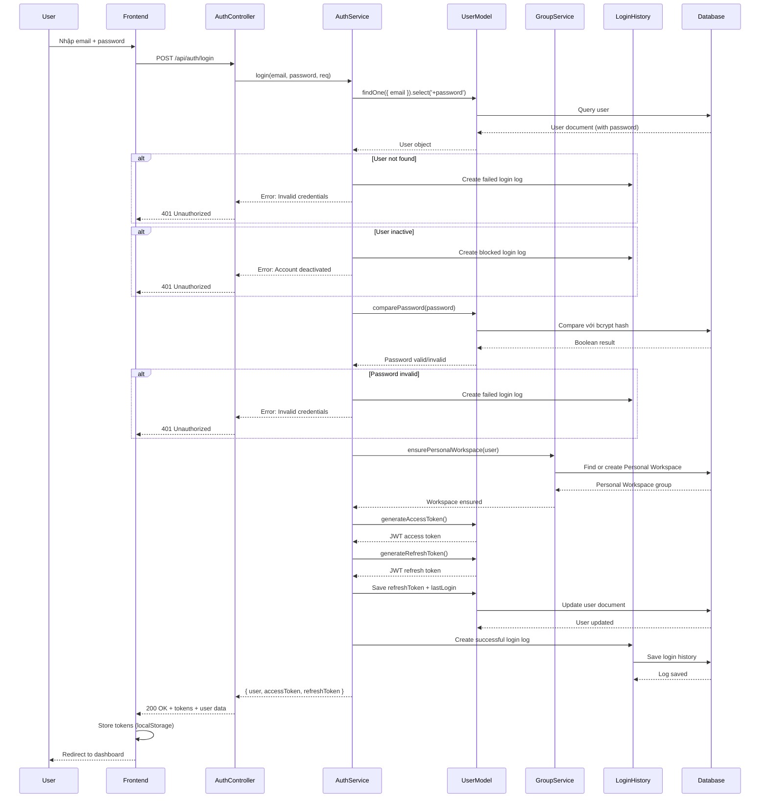
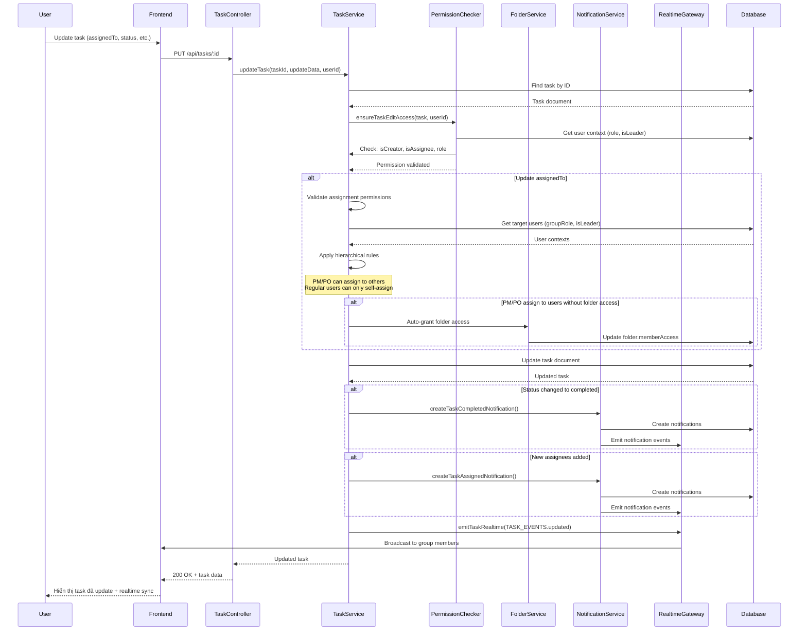
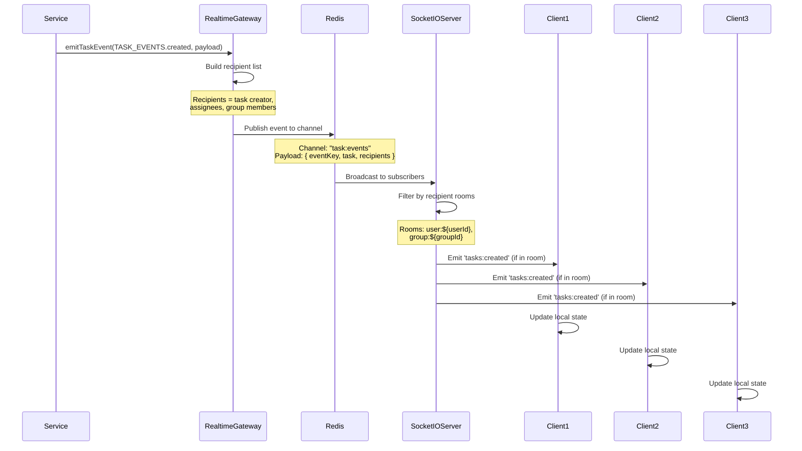

# Tài liệu Module Nghiệp vụ Cốt lõi - My Todo List App

## Mục lục
1. [Tổng quan](#tổng-quan)
2. [Class Diagram](#class-diagram)
3. [Code khung các Module quan trọng](#code-khung-các-module-quan-trọng)
4. [Source Code chi tiết](#source-code-chi-tiết)
5. [Giải thích Flow nghiệp vụ](#giải-thích-flow-nghiệp-vụ)

---

## Tổng quan

Dự án **My Todo List App** là một hệ thống quản lý công việc đa nền tảng với các module nghiệp vụ cốt lõi:

- **Task Management**: Quản lý công việc với đầy đủ tính năng (CRUD, assign, comments, attachments, timer)
- **Authentication & Authorization**: Xác thực người dùng với JWT, phân quyền theo role
- **Group Management**: Quản lý nhóm làm việc với phân quyền phức tạp
- **Real-time Communication**: Cập nhật real-time qua Socket.IO
- **Notification System**: Hệ thống thông báo đa kênh

---

## Class Diagram - Pha Phân tích Hệ thống

### Class Diagram Tổng quát (Analysis Phase - Domain Model & Business Logic)

Diagram này thể hiện cấu trúc tổng quát của hệ thống ở pha phân tích, bao gồm các lớp chính: Domain Models, Business Services, Controllers và các quan hệ giữa chúng.

```mermaid
classDiagram
    %% ========== DOMAIN MODELS (Entities) ==========
    class User {
        +ObjectId _id
        +String email
        +String password
        +String name
        +String avatar
        +String role
        +String groupRole
        +Boolean isLeader
        +ObjectId currentGroupId
        +comparePassword() Boolean
        +generateAccessToken() String
        +generateRefreshToken() String
        +toSafeObject() Object
    }
    
    class Task {
        +ObjectId _id
        +String title
        +String description
        +String status
        +String priority
        +Date dueDate
        +ObjectId createdBy
        +Array assignedTo
        +ObjectId groupId
        +ObjectId folderId
        +Array comments
        +Array attachments
        +Array activeTimers
        +Array timeEntries
        +populateUserInfo() Task
        +getFormattedTotalTime() String
    }
    
    class Group {
        +ObjectId _id
        +String name
        +String description
        +Boolean isPersonalWorkspace
        +ObjectId createdBy
        +Array members
        +ObjectId defaultFolderId
        +isMember() Boolean
        +getMemberRole() String
        +hasRole() Boolean
    }
    
    class Folder {
        +ObjectId _id
        +String name
        +String description
        +ObjectId groupId
        +ObjectId createdBy
        +Boolean isDefault
        +Array memberAccess
    }
    
    class Note {
        +ObjectId _id
        +String title
        +String content
        +ObjectId userId
        +ObjectId groupId
        +ObjectId folderId
        +Date lastEdited
    }
    
    class Notification {
        +ObjectId _id
        +String title
        +String message
        +String category
        +ObjectId recipient
        +ObjectId groupId
        +Boolean read
        +Date createdAt
    }
    
    class GroupMessage {
        +ObjectId _id
        +ObjectId groupId
        +ObjectId senderId
        +String content
        +Array attachments
        +Array reactions
    }
    
    class DirectMessage {
        +ObjectId _id
        +ObjectId conversationId
        +ObjectId senderId
        +String content
        +Array attachments
    }
    
    class DirectConversation {
        +ObjectId _id
        +Array participants
        +Date lastMessageAt
    }
    
    class LoginHistory {
        +ObjectId _id
        +ObjectId user
        +String email
        +String status
        +String ipAddress
        +Date loginAt
    }
    
    class AdminActionLog {
        +ObjectId _id
        +ObjectId admin
        +String action
        +String targetType
        +Object changes
    }

    %% ========== BUSINESS SERVICES ==========
    class TaskService {
        +createTask() Task
        +getTaskById() Task
        +getAllTasks() Object
        +updateTask() Task
        +deleteTask() Task
        +assignUsersToTask() Object
        +addComment() Task
        +uploadAttachments() Object
        +startTimer() Task
        +stopTimer() Task
        +getCalendarView() Object
        +getKanbanView() Object
    }
    
    class AuthService {
        +register() Object
        +login() Object
        +logout() void
        +loginWithGoogle() Object
        +refreshToken() Object
        +verifyToken() Object
        -validatePasswordStrength() Object
        -ensurePersonalWorkspace() Group
    }
    
    class GroupService {
        +createGroup() Object
        +getGroupById() Object
        +getGroupsForUser() Object
        +updateGroup() Object
        +deleteGroup() Object
        +addMembers() Object
        +removeMember() Object
        +inviteUserToGroup() Object
        +joinGroup() Object
        +switchToGroup() Object
    }
    
    class FolderService {
        +createFolder() Object
        +getFolderById() Object
        +getAllFolders() Object
        +updateFolder() Object
        +deleteFolder() Object
        +assignMembers() Object
        +resolveFolderContext() Object
    }
    
    class NoteService {
        +createNote() Object
        +getNoteById() Object
        +getAllNotes() Object
        +updateNote() Object
        +deleteNote() Object
    }
    
    class ChatService {
        +createMessage() Object
        +getMessages() Object
        +updateMessage() Object
        +deleteMessage() Object
        +uploadAttachment() Object
        +toggleReaction() Object
    }
    
    class DirectChatService {
        +createConversation() Object
        +getConversations() Object
        +createMessage() Object
        +getMessages() Object
    }
    
    class NotificationService {
        +createNotification() Object
        +getUserNotifications() Object
        +markAsRead() Object
        +markAllAsRead() Object
        +createTaskNotification() void
        +createGroupNotification() void
    }
    
    class AdminService {
        +getUsers() Object
        +getUserById() Object
        +createUser() Object
        +updateUser() Object
        +lockUser() Object
        +unlockUser() Object
        +assignAdmin() Object
        +getDashboardStats() Object
        +logAdminAction() void
    }
    
    class UserService {
        +getUserById() Object
        +updateProfile() Object
        +updatePassword() Object
        +updateAvatar() Object
        +updateNotificationSettings() Object
        +deactivateAccount() Object
    }
    
    class FileService {
        +uploadFile() Object
        +uploadMultipleFiles() Array
        +deleteFile() void
        +formatFileSize() String
    }

    %% ========== CONTROLLERS ==========
    class TaskController {
        +createTask() void
        +getTaskById() void
        +getAllTasks() void
        +updateTask() void
        +deleteTask() void
        +assignTask() void
        +addComment() void
        +uploadAttachments() void
        +startTimer() void
        +stopTimer() void
    }
    
    class AuthController {
        +register() void
        +login() void
        +logout() void
        +refreshToken() void
        +loginWithGoogle() void
        +getMe() void
    }
    
    class GroupController {
        +createGroup() void
        +getGroupById() void
        +getAllGroups() void
        +updateGroup() void
        +deleteGroup() void
        +addMembers() void
        +removeMember() void
        +inviteUser() void
    }
    
    class FolderController {
        +createFolder() void
        +getFolderById() void
        +getAllFolders() void
        +updateFolder() void
        +deleteFolder() void
        +assignMembers() void
    }
    
    class NoteController {
        +createNote() void
        +getNoteById() void
        +getAllNotes() void
        +updateNote() void
        +deleteNote() void
    }
    
    class ChatController {
        +createMessage() void
        +getMessages() void
        +updateMessage() void
        +deleteMessage() void
        +uploadAttachment() void
        +toggleReaction() void
    }
    
    class DirectChatController {
        +createConversation() void
        +getConversations() void
        +createMessage() void
        +getMessages() void
    }
    
    class NotificationController {
        +getNotifications() void
        +markAsRead() void
        +markAllAsRead() void
        +deleteNotification() void
    }
    
    class AdminController {
        +getDashboard() void
        +getUsers() void
        +getUserById() void
        +createUser() void
        +updateUser() void
        +lockUser() void
        +unlockUser() void
        +assignAdmin() void
        +sendNotification() void
        +getLoginHistory() void
        +getActionLogs() void
    }
    
    class UserController {
        +getProfile() void
        +updateProfile() void
        +updatePassword() void
        +uploadAvatar() void
        +updateNotificationSettings() void
        +updateLanguage() void
        +updateTheme() void
        +deactivateAccount() void
    }

    %% ========== REAL-TIME & INFRASTRUCTURE ==========
    class RealtimeGateway {
        +initialize() void
        +emitEvent() void
        +handleConnection() void
    }
    
    class TaskRealtimeGateway {
        +emitTaskEvent() void
        +TASK_EVENTS Object
    }
    
    class NotificationProducer {
        +publishNotification() void
        +createTaskNotification() void
        +createGroupNotification() void
    }

    %% ========== DOMAIN RELATIONSHIPS ==========
    Task --> User : createdBy, assignedTo
    Task --> Group : groupId
    Task --> Folder : folderId
    Group --> User : createdBy, members
    Folder --> Group : groupId
    Folder --> User : createdBy, memberAccess
    Note --> User : userId
    Note --> Group : groupId
    Note --> Folder : folderId
    Notification --> User : recipient
    Notification --> Group : groupId
    GroupMessage --> Group : groupId
    GroupMessage --> User : senderId
    DirectMessage --> DirectConversation : conversationId
    DirectMessage --> User : senderId
    DirectConversation --> User : participants
    LoginHistory --> User : user
    AdminActionLog --> User : admin

    %% ========== SERVICE TO DOMAIN RELATIONSHIPS ==========
    TaskService --> Task : manages
    TaskService --> Group : uses
    TaskService --> User : uses
    TaskService --> Folder : uses
    TaskService --> NotificationService : uses
    TaskService --> FileService : uses
    TaskService --> TaskRealtimeGateway : uses
    
    AuthService --> User : manages
    AuthService --> Group : creates
    AuthService --> LoginHistory : logs
    
    GroupService --> Group : manages
    GroupService --> User : uses
    GroupService --> Task : references
    GroupService --> NotificationService : uses
    
    FolderService --> Folder : manages
    FolderService --> Group : uses
    FolderService --> User : uses
    
    NoteService --> Note : manages
    NoteService --> User : uses
    NoteService --> Group : uses
    NoteService --> Folder : uses
    
    ChatService --> GroupMessage : manages
    ChatService --> Group : uses
    ChatService --> User : uses
    ChatService --> FileService : uses
    
    DirectChatService --> DirectMessage : manages
    DirectChatService --> DirectConversation : manages
    DirectChatService --> User : uses
    
    NotificationService --> Notification : manages
    NotificationService --> User : uses
    NotificationService --> NotificationProducer : uses
    
    AdminService --> User : manages
    AdminService --> LoginHistory : queries
    AdminService --> AdminActionLog : logs
    AdminService --> NotificationService : uses
    
    UserService --> User : manages
    
    FileService --> Cloudinary : external

    %% ========== CONTROLLER TO SERVICE RELATIONSHIPS ==========
    TaskController --> TaskService : calls
    AuthController --> AuthService : calls
    AuthController --> UserService : calls
    GroupController --> GroupService : calls
    FolderController --> FolderService : calls
    NoteController --> NoteService : calls
    ChatController --> ChatService : calls
    DirectChatController --> DirectChatService : calls
    NotificationController --> NotificationService : calls
    AdminController --> AdminService : calls
    UserController --> UserService : calls

    %% ========== REAL-TIME RELATIONSHIPS ==========
    TaskRealtimeGateway --> RealtimeGateway : extends
    NotificationProducer --> RealtimeGateway : uses
    TaskService --> TaskRealtimeGateway : triggers
    GroupService --> RealtimeGateway : triggers
    FolderService --> RealtimeGateway : triggers
```



### Giải thích Class Diagram

**1. Domain Models (Entities)**
- **User**: Entity trung tâm, quản lý thông tin người dùng, authentication, roles
- **Task**: Entity chính của hệ thống, quản lý công việc với đầy đủ tính năng
- **Group**: Quản lý nhóm làm việc, phân quyền, members
- **Folder**: Tổ chức tasks theo thư mục, có phân quyền riêng
- **Note**: Ghi chú trong group/folder
- **Notification**: Hệ thống thông báo
- **GroupMessage, DirectMessage, DirectConversation**: Chat functionality
- **LoginHistory, AdminActionLog**: Logging và audit

**2. Business Services**
- Chứa toàn bộ business logic của hệ thống
- **TaskService**: Logic nghiệp vụ phức tạp nhất, xử lý permission, assignment rules
- **AuthService**: Authentication, authorization, token management
- **GroupService**: Quản lý groups với hierarchical permissions
- **NotificationService**: Tạo và quản lý notifications
- Các services khác: Folder, Note, Chat, Admin, User, File

**3. Controllers**
- Xử lý HTTP requests/responses
- Gọi services để thực hiện business logic
- Không chứa business logic, chỉ routing và validation cơ bản

**4. Real-time & Infrastructure**
- **RealtimeGateway**: Base class cho real-time communication
- **TaskRealtimeGateway**: Emit events cho task changes
- **NotificationProducer**: Publish notifications qua Redis

**5. Quan hệ chính**
- **Domain Relationships**: Quan hệ giữa các entities (User-Task-Group-Folder)
- **Service to Domain**: Services quản lý và sử dụng các entities
- **Controller to Service**: Controllers gọi services
- **Real-time Relationships**: Services trigger real-time events

---

---

## Code khung các Module quan trọng

### 1. Task Service (Business Logic Layer)

**Vai trò**: Chứa toàn bộ business logic liên quan đến Task

```javascript
class TaskService {
  // Tạo task mới với validation và permission check
  async createTask(taskData) {
    // 1. Validate creator và group access
    // 2. Check folder assignment permissions
    // 3. Validate assignment permissions (PM/PO/Leader rules)
    // 4. Auto-grant folder access nếu cần
    // 5. Create task trong database
    // 6. Send notifications
    // 7. Emit realtime event
  }

  // Lấy task theo ID với populate
  async getTaskById(taskId) {
    // Populate user info, assignees, comments, etc.
  }

  // Lấy danh sách tasks với filter, sort, pagination
  async getAllTasks(filters, options, requesterId) {
    // 1. Validate group access
    // 2. Build folder-scoped filter (QA role)
    // 3. Apply filters (status, priority, search)
    // 4. Sort và paginate
    // 5. Return với populate
  }

  // Cập nhật task với permission check
  async updateTask(taskId, updateData, requesterId) {
    // 1. Check edit permission (creator, assignee, PM/PO, QA with folder access)
    // 2. Validate assignment permissions nếu update assignedTo
    // 3. Validate folder access nếu update folderId
    // 4. Update task
    // 5. Send notifications (assignment, completion)
    // 6. Emit realtime event
  }

  // Xóa task với permission check
  async deleteTask(taskId, requesterId) {
    // 1. Check delete permission (creator, PM/PO, QA with folder access)
    // 2. Delete Cloudinary files (attachments, comment attachments)
    // 3. Delete task
    // 4. Emit realtime event
  }

  // Gán users vào task với permission validation
  async assignUsersToTask(taskId, userIds, assignerId) {
    // 1. Validate assignment permissions (hierarchical rules)
    // 2. Check folder access nếu task có folder
    // 3. Auto-grant folder access nếu PM/PO assign
    // 4. Update task assignedTo
    // 5. Send notifications
    // 6. Emit realtime event
  }

  // Thêm comment vào task
  async addComment(taskId, userId, content) {
    // 1. Validate task exists
    // 2. Check comment limit (max 200)
    // 3. Add comment
    // 4. Send notifications to assignees và creator
    // 5. Emit realtime event
  }

  // Upload attachments với permission check
  async uploadAttachments(taskId, userId, files) {
    // 1. Check edit permission
    // 2. Check attachment limit (max 20)
    // 3. Upload to Cloudinary
    // 4. Save to task
    // 5. Emit realtime event
  }

  // Start timer cho task
  async startTimer(taskId, userId) {
    // 1. Check edit permission
    // 2. Validate task status (không cho completed/incomplete)
    // 3. Auto-change status từ todo → in_progress
    // 4. Add active timer
    // 5. Emit realtime event
  }

  // Stop timer và log time entry
  async stopTimer(taskId, userId) {
    // 1. Check edit permission
    // 2. Calculate elapsed time
    // 3. Add time entry
    // 4. Remove active timer
    // 5. Emit realtime event
  }
}
```

### 2. Auth Service (Authentication Layer)

**Vai trò**: Xử lý authentication và authorization

```javascript
class AuthService {
  // Đăng ký user mới
  async register(userData) {
    // 1. Check email exists
    // 2. Validate password strength
    // 3. Create user (password auto-hashed)
    // 4. Create Personal Workspace group
    // 5. Set currentGroupId
    // 6. Generate tokens
    // 7. Save refresh token
  }

  // Đăng nhập user
  async login(email, password, req) {
    // 1. Find user by email
    // 2. Check user exists và active
    // 3. Verify password (bcrypt)
    // 4. Ensure personal workspace exists
    // 5. Generate tokens
    // 6. Save refresh token
    // 7. Log login history
  }

  // Đăng nhập bằng Google
  async loginWithGoogle(idToken, req) {
    // 1. Verify Google ID token với Firebase
    // 2. Find or create user
    // 3. Ensure personal workspace
    // 4. Generate tokens
    // 5. Log login history
  }

  // Refresh access token
  async refreshToken(refreshToken) {
    // 1. Verify refresh token
    // 2. Find user
    // 3. Check token matches DB
    // 4. Generate new tokens (rotate)
    // 5. Save new refresh token
  }

  // Validate password strength
  validatePasswordStrength(password) {
    // Check: length >= 8, uppercase, lowercase, number, special char
  }
}
```

### 3. Group Service (Group Management Layer)

**Vai trò**: Quản lý groups và members với phân quyền

```javascript
class GroupService {
  // Tạo group mới
  async createGroup({ name, description, creatorId, members }) {
    // 1. Check creator permission (PM/PO/Leader)
    // 2. Validate member limit
    // 3. Create group với creator as member
    // 4. Set as user's current group
    // 5. Emit realtime event
  }

  // Lấy group theo ID với permission check
  async getGroupById(groupId, requesterId) {
    // 1. Validate group exists
    // 2. Check requester is member
    // 3. Return với populate
  }

  // Cập nhật group
  async updateGroup(groupId, requesterId, updateData) {
    // 1. Check group access
    // 2. Check permission (PM/PO/Leader hoặc personal owner)
    // 3. Update group
    // 4. Send notification nếu đổi tên
    // 5. Emit realtime event
  }

  // Xóa group
  async deleteGroup(groupId, requesterId) {
    // 1. Check permission
    // 2. Prevent delete personal workspace
    // 3. Cascade delete (folders, tasks, notes)
    // 4. Delete group
    // 5. Emit realtime event
  }

  // Thêm members vào group
  async addMembers(groupId, requesterId, members) {
    // 1. Check permission (PM/PO/Leader)
    // 2. Prevent add to personal workspace
    // 3. Validate member limit
    // 4. Add members
    // 5. Emit realtime event
  }

  // Xóa member khỏi group
  async removeMember(groupId, requesterId, memberId) {
    // 1. Check permission
    // 2. Hierarchical permission check (power level)
    // 3. Prevent remove owner
    // 4. Remove member
    // 5. Unassign from tasks
    // 6. Emit realtime event
  }

  // Mời user vào group
  async inviteUserToGroup(groupId, email, role, inviterId) {
    // 1. Check permission (PM/PO/Leader)
    // 2. Find user by email
    // 3. Check not already member
    // 4. Create invitation notification
  }
}
```

### 4. Task Controller (HTTP Layer)

**Vai trò**: Xử lý HTTP requests/responses, gọi service

```javascript
class TaskController {
  // Tạo task
  createTask(req, res) {
    // 1. Get userId từ JWT
    // 2. Get currentGroupId
    // 3. Call taskService.createTask()
    // 4. Return response
  }

  // Lấy task theo ID
  getTaskById(req, res) {
    // 1. Get taskId từ params
    // 2. Call taskService.getTaskById()
    // 3. Return response
  }

  // Lấy danh sách tasks
  getAllTasks(req, res) {
    // 1. Parse filters từ query
    // 2. Parse pagination options
    // 3. Call taskService.getAllTasks()
    // 4. Return response
  }

  // Cập nhật task
  updateTask(req, res) {
    // 1. Get taskId và updateData
    // 2. Call taskService.updateTask()
    // 3. Return response
  }

  // Xóa task
  deleteTask(req, res) {
    // 1. Get taskId
    // 2. Call taskService.deleteTask()
    // 3. Return response
  }

  // Gán users vào task
  assignTask(req, res) {
    // 1. Get taskId và userIds
    // 2. Call taskService.assignUsersToTask()
    // 3. Return response với meta info
  }

  // Thêm comment
  addComment(req, res) {
    // 1. Get taskId và content
    // 2. Call taskService.addComment()
    // 3. Return response
  }

  // Upload attachments
  uploadAttachments(req, res) {
    // 1. Get files từ multer
    // 2. Call taskService.uploadAttachments()
    // 3. Return response
  }

  // Start timer
  startTimer(req, res) {
    // 1. Get taskId
    // 2. Call taskService.startTimer()
    // 3. Return response
  }

  // Stop timer
  stopTimer(req, res) {
    // 1. Get taskId
    // 2. Call taskService.stopTimer()
    // 3. Return response
  }
}
```

---

## Source Code chi tiết

### 1. Task Service - createTask Method

```javascript
async createTask(taskData) {
  const creatorId = normalizeId(taskData.createdBy);
  if (!creatorId) {
    raiseError(ERROR_MESSAGES.INVALID_ID);
  }

  let groupMemberIds = null;
  let targetGroup = null;
  let requesterRole = null;

  // Validate group access
  if (taskData.groupId) {
    const groupId = normalizeId(taskData.groupId);
    const { group } = await ensureGroupAccess(groupId, creatorId);
    const requester = await getRequesterContext(creatorId);

    const isPersonalOwner =
      Boolean(group.isPersonalWorkspace) &&
      normalizeId(group.createdBy) === normalizeId(creatorId);

    const role = isPersonalOwner ? (requester.role || 'personal_owner') : requester.role;
    targetGroup = group;
    requesterRole = role;

    groupMemberIds = new Set(
      group.members.map(member => normalizeId(member.userId)).filter(Boolean)
    );
    taskData.groupId = groupId;

    // Resolve folder và check assignment
    const { folder } = await enforceFolderAccess({
      group,
      groupId,
      folderId: taskData.folderId,
      requesterId: creatorId,
      role: requesterRole,
      isLeader: requester.isLeader,
      requireWrite: true
    });

    taskData.folderId = folder ? folder._id : null;

    // Check folder assignment cho QA role
    let isAssignedToFolder = false;
    if (role === GROUP_ROLE_KEYS.QA && folder) {
      isAssignedToFolder = hasFolderAssignment(folder, creatorId);
    }

    // Check create permission
    if (!isPersonalOwner && !canCreateTasks({ 
      role: requesterRole, 
      isLeader: requester.isLeader, 
      isAssignedToFolder 
    })) {
      raiseError(ERROR_MESSAGES.GROUP_ACCESS_DENIED, HTTP_STATUS.FORBIDDEN);
    }
  }

  // Validate assignment permissions
  let assignedIds = [];
  if (Array.isArray(taskData.assignedTo)) {
    assignedIds = taskData.assignedTo
      .map(assignee => normalizeId(assignee?.userId || assignee))
      .filter(Boolean);
  }

  const requesterContext = await getRequesterContext(creatorId);
  const canAssignToOthers = targetGroup ? canAssignFolderMembers(requesterContext) : false;

  if (assignedIds.length > 0 && canAssignToOthers && targetGroup) {
    const permissionCheck = await validateAssignmentPermissions(
      requesterContext,
      assignedIds,
      creatorId
    );

    if (permissionCheck.errorMessage && permissionCheck.validIds.length === 0) {
      raiseError(permissionCheck.errorMessage, HTTP_STATUS.FORBIDDEN);
    }

    assignedIds = permissionCheck.validIds;
  } else if (!canAssignToOthers && assignedIds.length > 0) {
    const selfOnly = assignedIds.filter(id => id === creatorId);
    if (selfOnly.length !== assignedIds.length) {
      raiseError('Bạn chỉ có thể gán task cho chính mình.', HTTP_STATUS.FORBIDDEN);
    }
    assignedIds = selfOnly;
  }

  // Auto-assign to creator nếu không có assignees
  if (assignedIds.length === 0 && !canAssignToOthers) {
    assignedIds = [creatorId];
  }

  assignedIds = Array.from(new Set(assignedIds));

  // Validate assignees are in group
  if (groupMemberIds) {
    const outsideGroup = assignedIds.filter(id => !groupMemberIds.has(id));
    if (outsideGroup.length > 0) {
      raiseError(ERROR_MESSAGES.USER_NOT_IN_GROUP);
    }
  }

  // Auto-grant folder access nếu PM/PO assign
  if (taskData.folderId && targetGroup) {
    const folder = await Folder.findById(taskData.folderId);
    if (folder && !folder.isDefault) {
      const folderMemberAccess = new Set(
        (folder.memberAccess || []).map(access => normalizeId(access.userId)).filter(Boolean)
      );

      const assigneesWithoutAccess = assignedIds.filter(id => !folderMemberAccess.has(id));

      if (assigneesWithoutAccess.length > 0) {
        if (canAssignToOthers) {
          // PM/PO có thể auto-grant folder access
          const newMemberAccess = assigneesWithoutAccess.map(userId => ({
            userId: new mongoose.Types.ObjectId(userId),
            addedBy: new mongoose.Types.ObjectId(creatorId),
            addedAt: new Date()
          }));

          folder.memberAccess = folder.memberAccess || [];
          folder.memberAccess.push(...newMemberAccess);
          await folder.save();
        } else {
          raiseError('Không thể gán task cho người không có quyền truy cập vào folder này.', 
            HTTP_STATUS.FORBIDDEN);
        }
      }
    }
  }

  // Validate assignee limit
  if (assignedIds.length > LIMITS.MAX_ASSIGNEES_PER_TASK) {
    raiseError(`Task cannot have more than ${LIMITS.MAX_ASSIGNEES_PER_TASK} assignees`);
  }

  taskData.assignedTo = assignedIds.map(id => ({ userId: id }));

  // Create task
  const task = await Task.create(taskData);

  // Populate user info
  const populatedTask = await Task.findById(task._id)
    .populate('createdBy', 'name email avatar')
    .populate('assignedTo.userId', 'name email avatar')
    .populate('comments.user', 'name email avatar')
    .populate('groupId', 'name description');

  // Send notifications
  if (targetGroup) {
    try {
      const recipientIds = targetGroup.members
        .map(member => normalizeId(member.userId))
        .filter(id => id && id !== creatorId);

      if (recipientIds.length > 0) {
        await notificationService.createNewTaskNotification({
          groupId: targetGroup._id,
          senderId: creatorId,
          groupName: targetGroup.name,
          taskId: populatedTask._id,
          taskTitle: populatedTask.title,
          recipientIds,
          creatorName: populatedTask.createdBy?.name || null,
          priority: populatedTask.priority,
          dueDate: populatedTask.dueDate
        });
      }
    } catch (notificationError) {
      console.error('Failed to dispatch task creation notification:', notificationError);
    }
  }

  // Emit realtime event
  await emitTaskRealtime({
    taskDoc: populatedTask,
    groupDoc: targetGroup,
    eventKey: TASK_EVENTS.created,
    meta: {
      mutationType: 'create',
      source: 'task:create'
    }
  });

  return populatedTask;
}
```

### 2. Auth Service - login Method

```javascript
async login(email, password, req = null) {
  const getClientInfo = (req) => {
    if (!req) return { ipAddress: null, userAgent: null };
    return {
      ipAddress: req.ip || req.headers['x-forwarded-for'] || req.connection.remoteAddress,
      userAgent: req.headers['user-agent'] || null
    };
  };

  const clientInfo = getClientInfo(req);
  
  // 1. Find user by email (include password field)
  const user = await User.findOne({ email }).select('+password +refreshToken');
  
  // 2. Check if user exists
  if (!user) {
    // Log failed login attempt
    await LoginHistory.create({
      email,
      status: 'failed',
      failureReason: 'User not found',
      ipAddress: clientInfo.ipAddress,
      userAgent: clientInfo.userAgent,
      loginAt: new Date()
    }).catch(err => console.error('Error logging failed login:', err));
    throw new Error('Invalid credentials');
  }
  
  // 3. Check if user is active
  if (!user.isActive) {
    // Log blocked login attempt
    await LoginHistory.create({
      user: user._id,
      email: user.email,
      status: 'blocked',
      failureReason: 'Account deactivated',
      ipAddress: clientInfo.ipAddress,
      userAgent: clientInfo.userAgent,
      loginAt: new Date()
    }).catch(err => console.error('Error logging blocked login:', err));
    throw new Error('Account has been deactivated');
  }
  
  // 4. Compare password
  const isPasswordValid = await user.comparePassword(password);
  if (!isPasswordValid) {
    // Log failed login attempt
    await LoginHistory.create({
      user: user._id,
      email: user.email,
      status: 'failed',
      failureReason: 'Invalid password',
      ipAddress: clientInfo.ipAddress,
      userAgent: clientInfo.userAgent,
      loginAt: new Date()
    }).catch(err => console.error('Error logging failed login:', err));
    throw new Error('Invalid credentials');
  }
  
  // 5. Update lastLogin
  user.lastLogin = new Date();

  // Ensure personal workspace exists for legacy users
  await this.ensurePersonalWorkspace(user);
  
  // 6. Generate new tokens
  const accessToken = user.generateAccessToken();
  const refreshToken = user.generateRefreshToken();
  
  // 7. Save refresh token
  user.refreshToken = refreshToken;
  await user.save();
  
  // 8. Log successful login
  await LoginHistory.create({
    user: user._id,
    email: user.email,
    status: 'success',
    ipAddress: clientInfo.ipAddress,
    userAgent: clientInfo.userAgent,
    loginAt: new Date()
  }).catch(err => console.error('Error logging successful login:', err));
  
  // 9. Return user + tokens
  return {
    user: user.toSafeObject(),
    accessToken,
    refreshToken
  };
}
```

### 3. Group Service - createGroup Method

```javascript
async createGroup({ name, description, creatorId, members = [], memberIds = [] }) {
  const sanitizedName = name.trim();
  const sanitizedDescription = description ? description.trim() : '';

  const creatorIdStr = normalizeId(creatorId);

  // Check creator permission
  const creatorContext = await this.getRequesterContext(creatorIdStr);
  if (!canManageGroupSettings(creatorContext)) {
    return {
      success: false,
      statusCode: HTTP_STATUS.FORBIDDEN,
      message: 'You do not have permission to create groups'
    };
  }

  // Normalize members input
  const normalizedMembersInput = Array.isArray(members) && members.length > 0
    ? members
    : (Array.isArray(memberIds) ? memberIds.map(userId => ({ userId })) : []);

  const uniqueMemberIds = new Map();
  normalizedMembersInput
    .filter(Boolean)
    .forEach(entry => {
      const userId = normalizeId(entry.userId || entry);
      if (!userId || userId === creatorIdStr) {
        return;
      }
      uniqueMemberIds.set(userId, { userId });
    });

  if (!creatorIdStr) {
    return {
      success: false,
      statusCode: HTTP_STATUS.BAD_REQUEST,
      message: ERROR_MESSAGES.INVALID_ID
    };
  }

  // Validate member limit
  if (uniqueMemberIds.size + 1 > LIMITS.MAX_MEMBERS_PER_GROUP) {
    return {
      success: false,
      statusCode: HTTP_STATUS.BAD_REQUEST,
      message: ERROR_MESSAGES.GROUP_MEMBER_LIMIT_REACHED
    };
  }

  const membersArray = Array.from(uniqueMemberIds.entries());

  if (membersArray.some(([id]) => !isValidObjectId(id))) {
    return {
      success: false,
      statusCode: HTTP_STATUS.BAD_REQUEST,
      message: ERROR_MESSAGES.INVALID_ID
    };
  }

  // Validate users exist và active
  const users = await User.find({ _id: { $in: membersArray.map(([id]) => id) }, isActive: true })
    .select('_id name email avatar')
    .lean();
  const validMemberIds = new Set(users.map(user => user._id.toString()));

  // Create group
  const group = await Group.create({
    name: sanitizedName,
    description: sanitizedDescription,
    createdBy: creatorId,
    members: [
      { userId: creatorId, role: null, joinedAt: new Date() },
      ...membersArray
        .filter(([id]) => validMemberIds.has(id))
        .map(([id, payload]) => ({
          userId: id,
          role: null,
          joinedAt: new Date()
        }))
    ]
  });

  // Set this group as user's current group
  await User.findByIdAndUpdate(creatorId, { currentGroupId: group._id });

  // Populate members
  await group.populate([
    { path: 'members.userId', select: 'name email avatar' },
    { path: 'createdBy', select: 'name email avatar' }
  ]);

  // Emit realtime event
  const groupData = group.toObject ? group.toObject() : group;
  emitGroupEvent(GROUP_EVENTS.created, {
    group: groupData,
    recipients: group.members.map(member => normalizeId(member.userId)).filter(Boolean)
  });

  return {
    success: true,
    statusCode: HTTP_STATUS.CREATED,
    message: SUCCESS_MESSAGES.GROUP_CREATED,
    data: group
  };
}
```

### 4. Task Model Schema

```javascript
const taskSchema = new mongoose.Schema(
  {
    title: {
      type: String,
      required: [true, 'Tiêu đề công việc là bắt buộc'],
      trim: true,
      maxlength: [200, 'Tiêu đề không được vượt quá 200 ký tự']
    },
    description: {
      type: String,
      default: '',
      trim: true,
      maxlength: [2000, 'Mô tả không được vượt quá 2000 ký tự']
    },
    status: {
      type: String,
      enum: ['todo', 'in_progress', 'completed', 'incomplete', 'archived'],
      default: 'todo'
    },
    priority: {
      type: String,
      enum: ['low', 'medium', 'high', 'critical', 'urgent'],
      default: 'medium'
    },
    dueDate: {
      type: Date,
      default: null
    },
    completedAt: {
      type: Date,
      default: null
    },
    createdBy: {
      type: mongoose.Schema.Types.ObjectId,
      ref: 'User',
      required: [true, 'Người tạo công việc là bắt buộc']
    },
    assignedTo: [
      {
        userId: { type: mongoose.Schema.Types.ObjectId, ref: 'User', required: true },
        assignedAt: { type: Date, default: Date.now }
      }
    ],
    tags: [{
      type: String,
      trim: true,
      maxlength: [30, 'Mỗi tag không được vượt quá 30 ký tự']
    }],
    category: {
      type: String,
      default: null,
      trim: true
    },
    type: {
      type: String,
      enum: ['Operational', 'Strategic', 'Financial', 'Technical', 'Other'],
      default: 'Operational'
    },
    groupId: {
      type: mongoose.Schema.Types.ObjectId,
      ref: 'Group',
      required: [true, 'Group ID is required for task management']
    },
    folderId: {
      type: mongoose.Schema.Types.ObjectId,
      ref: 'Folder',
      default: null,
      index: true
    },
    attachments: [{
      filename: { type: String, required: true },
      url: { type: String, required: true },
      size: { type: Number, required: true },
      mimetype: { type: String, required: true },
      publicId: { type: String, required: true },
      resourceType: { type: String, default: 'raw' },
      uploadedBy: { type: mongoose.Schema.Types.ObjectId, ref: 'User' },
      uploadedAt: { type: Date, default: Date.now }
    }],
    comments: [{
      user: {
        type: mongoose.Schema.Types.ObjectId,
        ref: 'User',
        required: [true, 'User comment là bắt buộc']
      },
      content: {
        type: String,
        default: '',
        maxlength: [2000, 'Comment không được vượt quá 2000 ký tự'],
        trim: true
      },
      attachment: {
        type: {
          filename: { type: String },
          url: { type: String },
          size: { type: Number },
          mimetype: { type: String },
          publicId: { type: String },
          resourceType: { type: String }
        },
        default: undefined
      },
      createdAt: {
        type: Date,
        default: Date.now
      },
      updatedAt: {
        type: Date
      },
      isEdited: {
        type: Boolean,
        default: false
      },
      mentions: [{
        type: mongoose.Schema.Types.ObjectId,
        ref: 'User'
      }]
    }],
    activeTimers: [{
      userId: { type: mongoose.Schema.Types.ObjectId, ref: 'User' },
      startTime: { type: Date, default: Date.now }
    }],
    timeEntries: [{
      user: { type: mongoose.Schema.Types.ObjectId, ref: 'User', required: true },
      date: { type: Date, required: true, default: Date.now },
      hours: { type: Number, required: true },
      minutes: { type: Number, required: true },
      description: { type: String, trim: true },
      billable: { type: Boolean, default: true },
      startTime: { type: Date },
      endTime: { type: Date },
      createdAt: { type: Date, default: Date.now }
    }],
    repetition: {
      isRepeating: { type: Boolean, default: false },
      frequency: { type: String, enum: ['daily', 'weekly', 'monthly', 'yearly'], default: 'weekly' },
      interval: { type: Number, default: 1 },
      endDate: { type: Date },
      occurrences: { type: Number }
    },
    customStatus: {
      name: { type: String, trim: true },
      color: { type: String, default: '#3B82F6' }
    }
  },
  {
    timestamps: true,
    collection: 'tasks'
  }
);

// Auto-set completedAt khi status = 'completed'
taskSchema.pre('save', function (next) {
  if (this.isModified('status')) {
    if (this.status === 'completed' && !this.completedAt) {
      this.completedAt = new Date();
    } else if (this.status !== 'completed') {
      this.completedAt = null;
    }
  }
  next();
});

// Indexes cho performance
taskSchema.index({ createdBy: 1, status: 1 });
taskSchema.index({ groupId: 1, status: 1 });
taskSchema.index({ folderId: 1, status: 1 });
taskSchema.index({ 'assignedTo.userId': 1 });
taskSchema.index({ dueDate: 1 });
taskSchema.index({ priority: 1 });
taskSchema.index({ status: 1 });
taskSchema.index({ createdAt: -1 });
taskSchema.index({ type: 1 });
taskSchema.index({ title: 'text', description: 'text' });
```

### 5. User Model Schema

```javascript
const userSchema = new mongoose.Schema({
  email: {
    type: String,
    required: [true, 'Email is required'],
    unique: true,
    lowercase: true,
    trim: true,
    validate: {
      validator: validator.isEmail,
      message: 'Invalid email format'
    }
  },
  
  password: {
    type: String,
    required: [true, 'Password is required'],
    minlength: [8, 'Password must be at least 8 characters'],
    select: false  // Don't return password by default
  },
  
  name: {
    type: String,
    required: [true, 'Name is required'],
    trim: true,
    maxlength: [100, 'Name cannot exceed 100 characters']
  },
  
  avatar: {
    type: String,
    default: null
  },
  
  role: {
    type: String,
    enum: ['user', 'admin', 'super_admin'],
    default: 'user'
  },

  // Business role (assigned by admin)
  groupRole: {
    type: String,
    enum: GROUP_ROLES,
    default: null
  },

  // Lead flag (assigned by admin)
  isLeader: {
    type: Boolean,
    default: false
  },

  theme: {
    type: String,
    enum: ['light', 'dark', 'auto'],
    default: 'light'
  },

  language: {
    type: String,
    enum: ['en', 'vi'],
    default: 'en'
  },
  
  regionalPreferences: {
    timeZone: {
      type: String,
      default: 'UTC+00:00'
    },
    dateFormat: {
      type: String,
      enum: ['DD MMM YYYY', 'MMM DD, YYYY', 'DD/MM/YYYY', 'MM/DD/YYYY', 'YYYY-MM-DD'],
      default: 'DD MMM YYYY'
    },
    timeFormat: {
      type: String,
      enum: ['12h', '24h'],
      default: '12h'
    },
    weekStart: {
      type: String,
      enum: ['monday', 'sunday'],
      default: 'monday'
    }
  },
  
  isActive: {
    type: Boolean,
    default: true
  },
  
  isEmailVerified: {
    type: Boolean,
    default: false
  },
  
  lastLogin: {
    type: Date,
    default: null
  },
  
  refreshToken: {
    type: String,
    default: null,
    select: false
  },
  
  // Current active group for the user
  currentGroupId: {
    type: mongoose.Schema.Types.ObjectId,
    ref: 'Group',
    default: null
  }
}, {
  timestamps: true
});

// Pre-save middleware to hash password
userSchema.pre('save', async function(next) {
  if (!this.isModified('password')) return next();
  
  try {
    this.password = await bcrypt.hash(this.password, 12);
    next();
  } catch (error) {
    next(error);
  }
});

// Method to compare passwords
userSchema.methods.comparePassword = async function(candidatePassword) {
  return await bcrypt.compare(candidatePassword, this.password);
};

// Generate Access Token
userSchema.methods.generateAccessToken = function() {
  return jwt.sign(
    { 
      id: this._id, 
      email: this.email, 
      role: this.role
    },
    JWT_SECRET,
    { expiresIn: JWT_EXPIRES_IN }
  );
};

// Generate Refresh Token
userSchema.methods.generateRefreshToken = function() {
  return jwt.sign(
    { id: this._id },
    JWT_REFRESH_SECRET,
    { expiresIn: JWT_REFRESH_EXPIRES_IN }
  );
};

// Method to get user object without sensitive data
userSchema.methods.toSafeObject = function() {
  const user = this.toObject();
  delete user.password;
  delete user.refreshToken;
  delete user.passwordResetToken;
  delete user.passwordResetExpires;
  return user;
};
```

---

## Giải thích Flow nghiệp vụ

### Flow 1: Tạo Task mới



**Giải thích chi tiết:**

1. **Request từ Frontend**: User điền form tạo task, Frontend gửi POST request với JWT token
2. **Controller Layer**: Extract userId từ JWT, lấy currentGroupId, gọi TaskService
3. **Service Layer - Validation**:
   - Validate group access (user phải là member)
   - Validate folder access (nếu có folderId)
   - Check create permission (role-based: PM/PO/Leader/QA với folder assignment)
4. **Assignment Permission Check**:
   - PM/PO (non-lead): Chỉ assign được cho roles khác, không assign được PM/PO lead hoặc PM/PO khác
   - Leader (non-PM/PO): Chỉ assign được cho chính mình và business roles khác, không assign được lead khác
   - PM/PO Lead: Có thể assign cho mọi người
5. **Auto-grant Folder Access**: Nếu PM/PO assign task cho user chưa có folder access, tự động grant
6. **Create Task**: Lưu vào database với assignedTo, folderId, etc.
7. **Notifications**: Tạo notifications cho group members (trừ creator)
8. **Realtime Event**: Emit event qua Socket.IO để update real-time cho tất cả clients trong group

### Flow 2: Đăng nhập User



**Giải thích chi tiết:**

1. **Input Validation**: Frontend gửi email + password
2. **Find User**: Query database với email, include password field
3. **Security Checks**:
   - User exists?
   - User is active?
   - Password correct? (bcrypt compare)
4. **Logging**: Mỗi attempt (success/failed/blocked) đều được log vào LoginHistory
5. **Personal Workspace**: Đảm bảo user có Personal Workspace (tự động tạo nếu chưa có)
6. **Token Generation**:
   - Access Token: Short-lived (7 days), chứa user info
   - Refresh Token: Long-lived (30 days), chỉ chứa user ID
7. **Save Tokens**: Refresh token được lưu vào database để validate sau này
8. **Response**: Trả về user data (không có password) + tokens

### Flow 3: Cập nhật Task với Assignment



**Giải thích chi tiết:**

1. **Permission Check**: 
   - Edit permission: Creator, Assignee, PM/PO, hoặc QA với folder assignment
   - Delete permission: Chỉ Creator, PM/PO, hoặc QA với folder assignment
2. **Assignment Validation**:
   - Hierarchical rules: PM/PO có thể assign, regular users chỉ self-assign
   - Folder access: Nếu task có folder, assignees phải có folder access (hoặc được auto-grant)
3. **Update Task**: Apply changes với validation
4. **Notifications**:
   - Task completed: Notify group members
   - New assignees: Notify assigned users
5. **Realtime Sync**: Emit event để tất cả clients trong group nhận update real-time

### Flow 4: Real-time Event Broadcasting



**Giải thích chi tiết:**

1. **Event Emission**: Service gọi `emitTaskEvent()` với event type và payload
2. **Recipient Building**: Xác định danh sách users cần nhận event (creator, assignees, group members)
3. **Redis Pub/Sub**: Publish event vào Redis channel để scale across multiple servers
4. **Socket.IO Broadcasting**: Server nhận từ Redis, filter theo rooms (user rooms, group rooms)
5. **Client Update**: Clients nhận event qua Socket.IO, update local state, re-render UI

---

## Tóm tắt

### Các Module Nghiệp vụ Cốt lõi:

1. **TaskService**: 
   - Quản lý toàn bộ business logic của Task
   - Permission checking phức tạp (hierarchical roles)
   - Auto-grant folder access
   - Real-time event emission

2. **AuthService**:
   - Authentication với JWT (access + refresh tokens)
   - Password hashing với bcrypt
   - Login history logging
   - Personal workspace auto-creation

3. **GroupService**:
   - Group CRUD operations
   - Member management với hierarchical permissions
   - Invitation system
   - Real-time updates

4. **Models**:
   - Task: Rich schema với comments, attachments, timers, time entries
   - User: Authentication fields, role-based permissions
   - Group: Member management, personal workspace flag

### Điểm nổi bật:

- **Layered Architecture**: Controller → Service → Model, separation of concerns rõ ràng
- **Permission System**: Hierarchical role-based với PM/PO/Leader rules
- **Real-time Updates**: Socket.IO + Redis pub/sub cho scaling
- **Auto-grant Logic**: PM/PO có thể auto-grant folder access khi assign task
- **Comprehensive Logging**: Login history, notification tracking
- **Data Validation**: Schema validation, business rule validation

---

**Tài liệu này cung cấp đầy đủ thông tin về các module nghiệp vụ cốt lõi của dự án để bổ sung vào báo cáo đồ án.**

